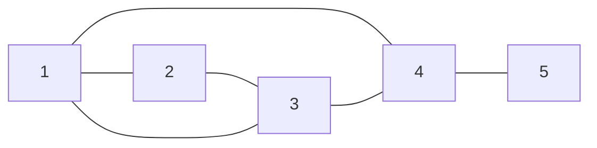

# Concepts

A distributed algorithm is a complex of at least two isolated local processes interacting with one another by exchanging only messages and a communication subsystem providing this interaction.

## Local Processes and Their Interaction

Under building models of local processes, the following modeling presumptions are used.

1. Each local process of a distributed algorithm is uniquely identified by some natural number called its logical identifier.
2. The set of local processes does not change during performing the computational process specified by a distributed algorithm and is denoted by $\mathbb P_n$ where $n$ is the number of local processes.
3. The set of logical identifiers of $\mathbb P_n$ equals $\\{1, 2,\ldots,n\\}$.
4. Each process can send a message to some non-empty subset of other processes and this subset does not equal $\mathbb P_n$ in general.
So, a function $\mathop{\mathrm{neighbors}}:\mathbb P_n\to2^{\mathbb P_n}$ that associates such a subset with each process is needed.
5. It is not possible to send messages to yourself.
6. For any $p,q\in\mathbb P_n$, information from $p$ to $q$ can be delivered by a sequence of message exchanging between neighbor processes always.

More formally, the presumptions (5) and (6) are represented by the following constraints for the function $\mathop{\mathr{neighbors}}$.

1. $p\notin\mathop{\mathrm{neighbors}}(p)$ for any $p\in\mathbb P_n$;
2. $q\in\mathop{\mathrm{delivery}}(p)$ for any $p,q\in\mathbb P_n$.

Here, $\mathop{\mathrm{delivery}}:\mathbb P\to2^{\mathbb P_n}$ is the least function that satisfies the following conditions

* $q\in\mathop{\mathrm{neighbors}}(p)\Rightarrow q\in\mathop{\mathrm{delivery}}(p)$ for any $p,q\in\mathbb P_n$;
* $p'\in\mathop{\mathrm{neighbors}}(p)\land q\in\mathop{\mathrm{delivery}}(p')\Rightarrow q\in\mathop{\mathrm{delivery}}(p)$ for any $p,p',q\in\mathbb P_n$.

### How to build $\mathop{\mathrm{delivery}}$

One can use the following method to build the function $\mathop{\mathrm{delivery}}$ that corresponds to function $\mathop{\mathrm{neighbors}}$.

**Require:** the function $f:\mathbb P_n\to2^{\mathbb P_n}$ and $p\in\mathbb P_n$.<br/>
**Ensure:** the set $f^+(p)\in2^{\mathbb P_n}$.

>1. $R\gets\\\{p\\}$
>2. $N\gets R\cup\\{q\in\mathbb P_n\setminus R\mid q\in f(p')\text{ for some }p'\in R\\}$
>3. if $N\neq R$ then $R\gets N$ and jump to 2
>4. the result is $R$

**Proposition.**
The described above method has no infinite loop.<br/>
*Proof.*<br/>
There is only one potentially infinite loop of the method, namely 2 - 3.
If $R_0,R_1,\ldots$ is the sequence of values of variable $R$ generated by computation progress then $R_k\subset R_{k+1}$ for all natural $k$.
Taking into account that all $R_k\subset\mathbb P_n$, which is finite, then for some $k$, $R_k=R_{k+1}$.
It means that $N=R$ at this step and, therefore, the loop terminates.
<br/>$\Box$

**Proposition.**
For a function $f:\mathbb P_n\to2^{\mathbb P_n}$, the function $f^+:\mathbb P_n\to2^{\mathbb P_n}$ obtained by using the described above method, satisfies the condition
$$\forall\ p,q,r\in\mathbb P_n,\ q\in f^+(p)\Rightarrow r\in f^+(q)\Rightarrow r\in f^+(p).$$

### Realization

Local processes of a distributed algorithm are identified with positive natural numbers lying in the diapason from 1 to $n$ (the number of the local processes).

A list of lists of positive integers models the function $\mathop{\mathrm{neighbors}}$. In such a list, the list located at the $k$-th place identifies neighbors of the process with the logical identifier equals $k+1$.
Thus, each inner list contains numbers from the diapason from 1 to $n$.

**Example.**
This communication graph


is represented by the YAML-file with the next content

```
neighborhood:
  - [2, 3, 4]
  - [1, 3]
  - [1, 2, 4]
  - [1, 3, 5]
  - [4]
```
