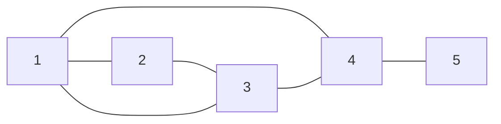

# Concepts

A distributed computation is a complex consisting

- of at least two isolated local processes interacting with one another by exchanging only messages and
- of a communication subsystem providing this interaction.

## Local processes

We assume that

>each local process of a distributed computation is performed sequentially, identified by a natural number from the diapason $1\ldots n$ where $n>2$ is the fixed number of the distributed computation local processes.
To refer to the set of these local processes we use the notation $\mathbb P_n$.

## Local processes interaction

Regarding local process interaction, we assume

>1. each local process is associated with some non-empty subset of other local processes called its neighbors.
The process can send a message directly to neighbors only.
The subset of neighbors of $p\in\mathbb P_n$ does not equal $\mathbb P_n$ as a rule and it is referred to as $\mathop{\mathrm{neighbor}}(p)$.
>2. Regarding to $\\{\mathop{\mathrm{neighbor}}(p)\subset\mathbb P_n\mid p\in\mathbb P_n\\}$ ia assumed the following
>    - any process can send no message to itself;
>    - a piece of information can be delivered from any local process to any other local process with a sequence of direct message exchanges.  

## Constraints for $\mathop{\mathrm{neighbor}}$

Let us associate with a function $f:\mathbb P_n\to2^{\mathbb P_n}$ the following operator $F:2^{\mathbb P_n}\to2^{\mathbb P_n}$

$$F(A)=A\cup\\{q\in\mathbb P_n\mid q\in f(p)\text{ for some $p\in A$}\\}.$$

This operator is evidently monotonic and due to Knaster–Tarski theorem, for any $A\subset\mathbb P_n$, it has the least fixed point $T$ such that $A\subset T$.

Now, we can rigorously formulate constraints for admissible functions $\mathop{\mathrm{neighbor}}$:

>1. $p\notin\mathop{\mathrm{neighbor}}(p)$ for any $p\in\mathbb P_n$;
>2. for any $p\in\mathbb P_n$, the least fixed point $T_p$ of the operator associated with $\mathop{\mathrm{neighbor}}$ such that $\\{p\\}\subset T_p$ equals $\mathbb P_n$.

## Realization

Local processes of a distributed сщьзгефешщт are identified with positive natural numbers lying in the range from 1 to $n$ (the number of the local processes).

A list of lists of positive integers models the function $\mathop{\mathrm{neighbors}}$. In such a list, the list located at the $k$-th place identifies neighbors of the process with the logical identifier equals $k+1$.
Thus, each inner list contains numbers from the diapason from 1 to $n$.

**Example.**
This communication graph


is represented by the YAML-file with the next content

```
neighborhood:
  - [2, 3, 4]
  - [1, 3]
  - [1, 2, 4]
  - [1, 3, 5]
  - [4]
```
**Task.**
Realize utilities checking the constraints for $\mathop{\mathrm{neighbor}}$.
